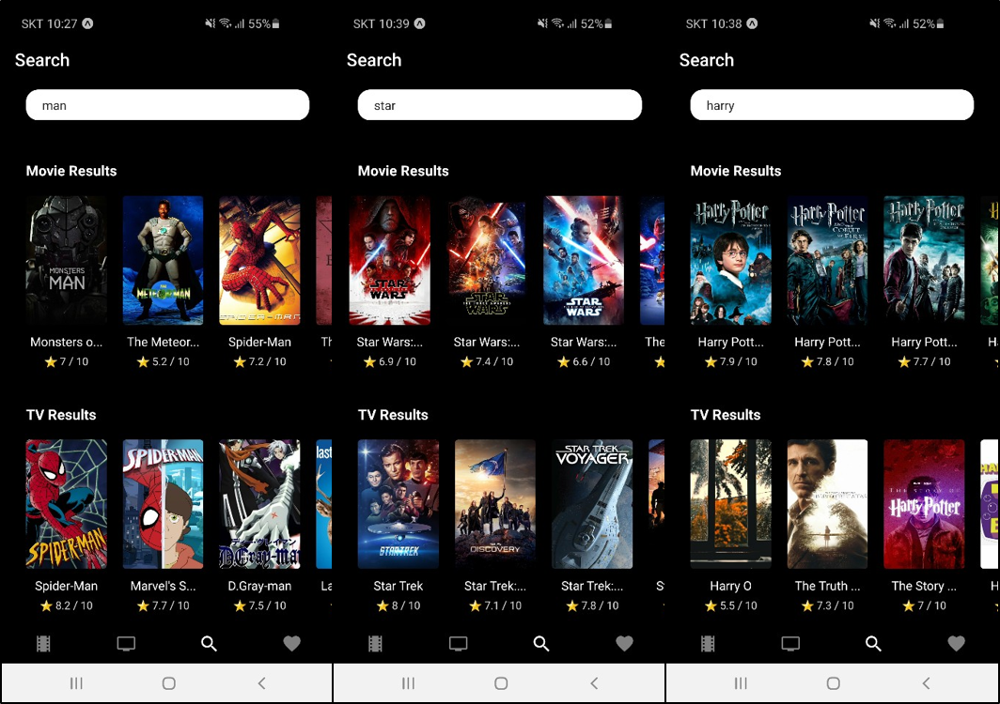

# 🎬 Souvies

> 노마드코더 Course 중 React Native를 이용한 클론코딩 프로젝트입니다.

### 🎥**Souvenir + Movies**🎥


## 📱 실행 화면

### 🎡 리스트 페이지

 


### 🎡 상세 페이지

 


### 🎡 검색페이지

 


## 🎯 프로젝트 소개

**"Souvies는 실시간으로 영화와 TV Show에 관한 정보를 볼 수 있습니다!"**

`Souvies`는 `react-native`를 사용하여 제작한 어플리케이션입니다.

 [TMDB](https://www.themoviedb.org/?language=ko) API를 사용하여 영화와 TV Show 리스트를 나타낼 수 있으며, 

검색 기능을 통해 원하는 영화와 TV Show를 찾을 수 있습니다.

상세 페이지를 통해 관련된 자세한 정보를 볼 수 있습니다! 😎


## ⛳️ 프로젝트 시작하기

### 🎨 Clone

```
git clone https://github.com/souvenir718/souvies
```


### 🎨 Start

```
cd souvies
npm install
npm start
```


### 🏆[Certificate](https://github.com/souvenir718/TIL/blob/master/Certificate/%EC%B4%88%EB%B3%B4%EB%A5%BC%20%EC%9C%84%ED%95%9C%20React%20Native.pdf)